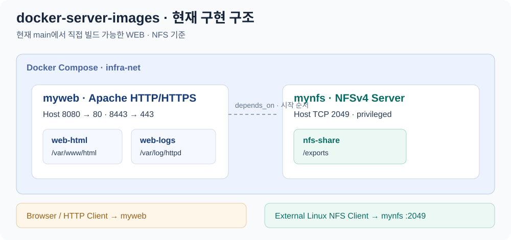

# docker-server-images

**Rocky Linux 9 기반 Apache 웹 서버와 NFSv4 공유 저장소를 Docker 이미지로 구성한 팀 프로젝트입니다.** 웹 콘텐츠·TLS 설정을 이미지에 담고, NFS 공유 경로와 접근 대상을 실행 시 환경변수로 설정합니다.

현재 `main`의 구현은 **WEB·NFS**입니다. DNS·FTP·MAIL은 서비스 이름, 포트, 볼륨을 정한 Compose 구성과 작업 디렉토리가 준비되어 있습니다.

## 현재 구현 구조



그림은 현재 `main`에서 직접 빌드할 수 있는 **WEB·NFS**만 나타냅니다. Compose에는 DNS·FTP·MAIL 서비스 정의도 있지만 해당 이미지 구현은 아직 포함되어 있지 않습니다. 또한 WEB 로그의 `web-logs`와 NFS의 `nfs-share`는 별도 볼륨이며, WEB 로그를 NFS로 자동 마운트하는 구성은 없습니다.

## 역할과 책임

| 참여자 | 담당 | 주요 작업 |
|---|---|---|
| **tjung03** | 프로젝트 운영·공통 실행 구성·NFS | 서버별 작업·완료 기준 수립, Git 협업 규칙 정리, Compose 구성과 PR 통합, NFSv4 서버 구현 |
| **joohuijin** | WEB | Apache HTTP/HTTPS 이미지, 자체 서명 인증서, 웹 콘텐츠와 사용자 지정 404 응답 구현 |

작업 기록: [작업·완료 기준](https://github.com/tjung03/docker-server-images/issues/1) · [협업 규칙](https://github.com/tjung03/docker-server-images/commit/6b0f38c39c9fd836061d6dcf8447bfdf4da203eb) · [Compose 구성](https://github.com/tjung03/docker-server-images/commit/266f1072514e1db4bb811b591e0d7c1bdd057843) · [WEB PR](https://github.com/tjung03/docker-server-images/pull/9) · [NFS PR](https://github.com/tjung03/docker-server-images/pull/10)

## 저장소 구조

```text
.
├── web/                      # Apache 이미지, TLS 설정, 웹 콘텐츠 아카이브
├── nfs/
│   ├── Dockerfile            # NFS 패키지와 공유 디렉토리 구성
│   ├── entrypoint.sh         # 환경변수 → export 생성 → NFS 시작·종료
│   ├── exports.d/            # 기본 export 설정과 경로 설명
│   └── default-share/logs/   # 공유 저장소의 초기 디렉토리
├── compose/docker-compose.yml
├── dns/ · ftp/ · mail/       # 서비스별 작업 디렉토리
├── scripts/setup-bashrc.sh   # 팀 실습용 셸 설정
└── docs/
    ├── usage.md             # NFS 실행·확인, Compose 구성, WEB 콘텐츠
    └── collaboration.md     # 팀 작업 규칙과 이미지 배포 절차
```

## 주요 구현

### WEB · Apache HTTP/HTTPS 이미지

[WEB Dockerfile](web/Dockerfile)은 Apache와 `mod_ssl`을 설치하고, 웹 콘텐츠와 TLS 설정을 이미지에 함께 배치합니다. 컨테이너 시작 시 `httpd -D FOREGROUND`를 실행하여 Apache 프로세스로 웹 요청을 처리합니다.

| 구현 지점 | 동작 | 코드 |
|---|---|---|
| HTTPS 구성 | 빌드 시 RSA 2048비트·365일 자체 서명 인증서를 생성하고, 443 가상 호스트에서 인증서·키 경로를 참조 | [Dockerfile](web/Dockerfile), [ssl.conf](web/ssl.conf) |
| 디렉토리별 설정 | HTTP 문서 루트와 HTTPS 가상 호스트의 `/var/www/html`에 `AllowOverride All`을 적용하여 `.htaccess` 사용 | [Dockerfile](web/Dockerfile), [ssl.conf](web/ssl.conf) |
| 콘텐츠 배포 | `src.tar`의 홈 페이지·오류 페이지·`.htaccess`를 빌드 시 문서 루트에 배치 | [src.tar](web/src.tar), [콘텐츠 구성](docs/usage.md#web-콘텐츠) |
| 사용자 지정 오류 응답 | `.htaccess`의 `ErrorDocument 404 /error.html`로 없는 경로의 요청을 오류 페이지에 연결 | [오류 페이지](web/error.html), [동작 확인](docs/usage.md#web-설정과-응답-확인) |

HTTP와 HTTPS는 같은 문서 루트를 사용합니다. 홈 페이지 접속과 없는 경로의 요청으로 콘텐츠 배포·TLS·디렉토리 설정 적용을 각각 확인할 수 있습니다.

### NFS · 환경변수 기반 공유 저장소

[NFS Dockerfile](nfs/Dockerfile)은 서버 패키지와 공유 디렉토리를 준비하고, [entrypoint.sh](nfs/entrypoint.sh)가 실행 시 허용 클라이언트·export 옵션·스레드 수를 읽어 서버를 시작합니다.

`/exports`를 NFSv4의 기준 경로(`fsid=0`)로 잡아, 클라이언트가 `서버주소:/share`로 공유 디렉토리에 접근하도록 구성했습니다. `/exports`에는 Docker 볼륨을 연결하고, 공유 디렉토리 아래에는 로그 저장용 `logs/`를 준비합니다.

진입 스크립트는 export 파일 생성, `nfsd` 파일시스템 마운트, 커널 NFS 서버와 `rpc.mountd` 시작을 순서대로 수행합니다. `SIGTERM`·`SIGINT`를 받으면 helper 프로세스 종료, export 해제, NFS 스레드 종료를 처리합니다. [공유 경로·환경변수](docs/usage.md#공유-경로와-환경변수)에서 각 설정을 확인할 수 있습니다.

## WEB 빠른 실행

Docker가 설치된 환경에서 저장소 루트를 기준으로 실행합니다. 호스트의 `8080`, `8443` 포트를 사용합니다.

```bash
git clone https://github.com/tjung03/docker-server-images.git
cd docker-server-images
docker build -t infra-web:1.0 ./web
docker run -d --name myweb -p 8080:80 -p 8443:443 infra-web:1.0
```

```bash
curl -i http://localhost:8080/
curl -ki https://localhost:8443/
curl -i http://localhost:8080/missing-page
```

홈 페이지의 `Welcome to infra-web Server!`와, 없는 경로의 HTTP `404` 및 `My Custom 404 Error Page` 응답을 확인합니다. HTTPS의 `-k`는 이미지에서 생성한 자체 서명 인증서를 사용하기 위한 실습 옵션입니다.

웹 콘텐츠는 [src.tar](web/src.tar)의 `index.html`, `error.html`, `.htaccess`를 빌드 시 `/var/www/html`에 풀어 배치합니다. 콘텐츠를 수정할 때는 [아카이브 갱신 방법](docs/usage.md#web-콘텐츠)을 따릅니다.

종료·제거:

```bash
docker stop myweb
docker rm myweb
```

## NFS 실행과 확인

NFS는 Docker 호스트의 Linux 커널 `nfsd`를 사용합니다. **NFS 서버를 실행할 수 있는 Linux 호스트와 `--privileged` 권한**, 클라이언트에서 서버로 연결할 TCP `2049`가 필요합니다.

[실행 가이드](docs/usage.md#nfs-단독-실행)에는 이미지 빌드, 허용 클라이언트 지정, 외부 Linux 클라이언트의 `:/share` 마운트, 파일 쓰기·읽기 확인을 정리했습니다. [PR #10](https://github.com/tjung03/docker-server-images/pull/10)에는 작성 당시의 로컬 빌드·서버 시작·외부 마운트·파일 생성 및 삭제 동기화 확인 기록이 있습니다.

## 사용 기술과 실행 구성

| 항목 | 저장소 설정 |
|---|---|
| 이미지 기반 | WEB·NFS 모두 `rockylinux:9` |
| WEB | `httpd`, `mod_ssl`, 빌드 시 생성하는 RSA 2048비트·365일 자체 서명 인증서 |
| NFS | `nfs-utils`, Linux 커널 NFS 서버, NFSv4 활성화·v3 비활성화 |
| 시작 스크립트 | Bash, 환경변수로 export·스레드 수·공유 권한 설정 |
| 통합 실행 구성 | Docker Compose, `infra-net` 브리지, `172.30.0.0/24` |
| 테스트 클라이언트 정의 | `alpine:3.23` |

패키지는 Rocky Linux 9 저장소에서 빌드 시 설치됩니다. `infra-web:1.0`과 `infra-nfs:1.0`은 프로젝트의 이미지 태그입니다. 실제 패키지 버전 확인 명령은 [실행 가이드](docs/usage.md#설치-패키지-확인)에 있습니다.

Compose에서 WEB은 `web-html`·`web-logs`, NFS는 `nfs-share`라는 별도 볼륨을 사용합니다. WEB의 `depends_on: mynfs`는 시작 순서를 지정하며, 로그 공유에는 NFS 클라이언트 마운트 구성이 추가로 필요합니다. [Compose 실행 구성](docs/usage.md#compose-실행-구성)에서 서비스별 포트와 저장 경로를 볼 수 있습니다.

팀의 브랜치·커밋·이미지 이름 규칙은 [협업 가이드](docs/collaboration.md)에 정리했습니다.
